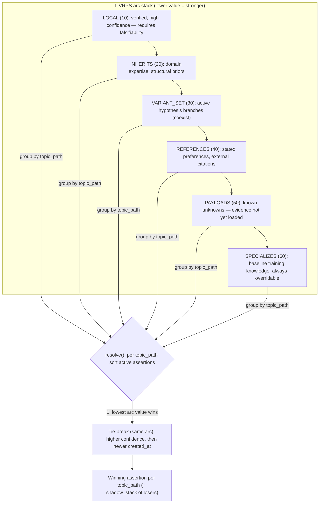
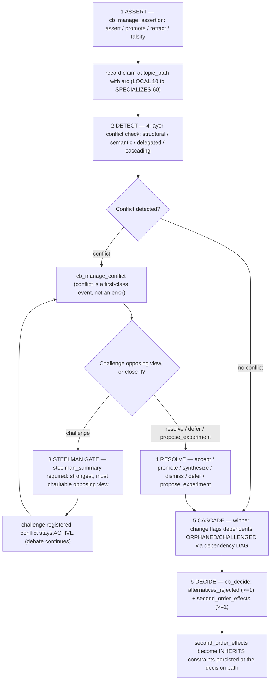
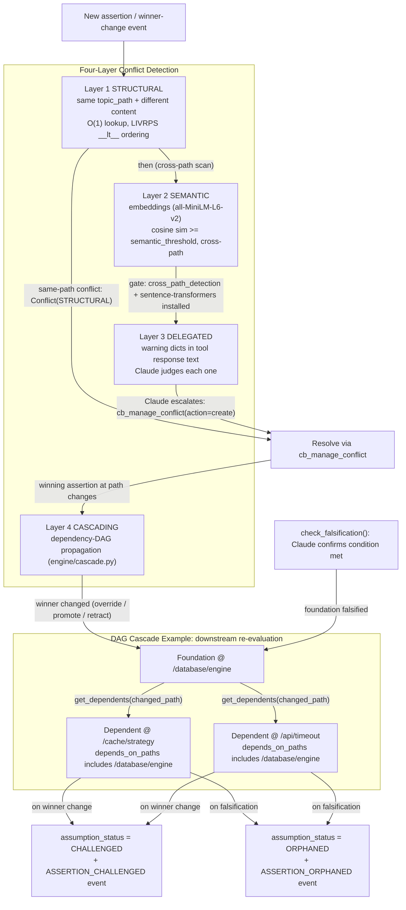
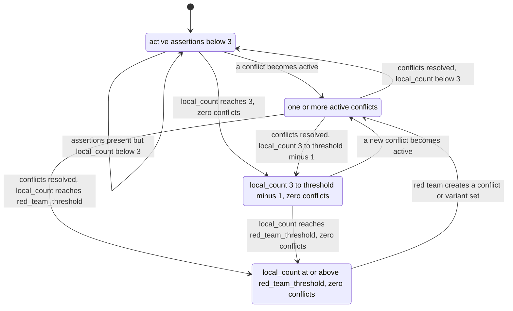
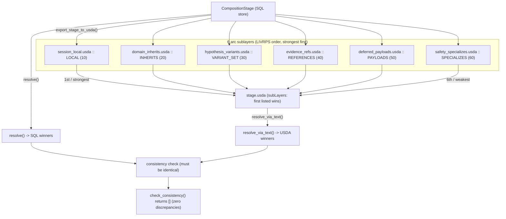
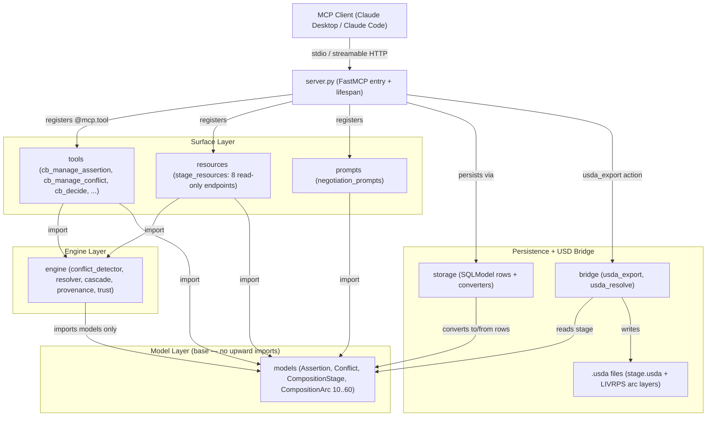
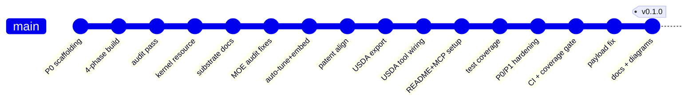
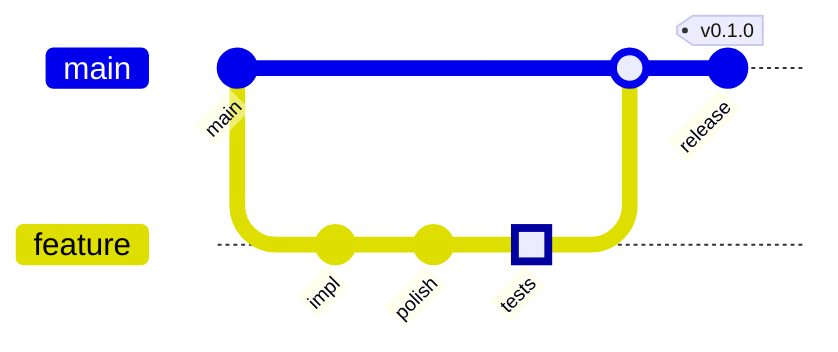

# Cognitive Bridge

[](https://github.com/JosephOIbrahim/Cognitive-Bridge/releases)
[](https://www.python.org/downloads/)
[](#development)
[](https://modelcontextprotocol.io)
[](#usd-composition-bridge)
[](#license)

**An MCP server that gives AI a compositional mind** — a memory it can't lose, and
the backbone to flag a contradiction instead of quietly going along with it.

> **TL;DR** — Normal AI assistants forget what you told them and rarely push back.
> Cognitive Bridge gives the AI a notebook it can't lose and one hard rule: surface
> contradictions, don't bury them. The ranking math that decides which idea "wins" is
> borrowed *exactly* from **USD** — the layering format animation studios use to stack
> 3D scenes — and the code proves the two are mechanically identical.

**Tags:** `mcp` · `model-context-protocol` · `claude` · `usd` · `openusd` · `livrps` · `argumentation-framework` · `critical-thinking` · `knowledge-graph` · `reasoning` · `fastmcp` · `pydantic` · `sqlite` · `python`

---

## Table of Contents

- [In Plain English](#in-plain-english)
- [What Does This Do?](#what-does-this-do)
- [Installation](#installation)
- [Claude Desktop Setup](#claude-desktop-setup)
- [How It Works](#how-it-works)
- [USD Composition Bridge](#usd-composition-bridge)
- [Tools](#tools)
- [Resources and Prompts](#resources-and-prompts)
- [Examples](#examples)
- [Architecture](#architecture)
- [Development](#development)
- [Development History](#development-history)
- [Contributing](#contributing)
- [The Novel Claim](#the-novel-claim)
- [License](#license)

---

## In Plain English

*New here? Start with this. Want the technical version? Jump to [How It Works](#how-it-works).*

**The problem: AI has goldfish memory.**
Tell a chat assistant in message 5 that your app uses PostgreSQL, and by message 50 it
will happily suggest MongoDB — with no memory that it just contradicted you.

**The fix: give it a notebook with rules.**
Cognitive Bridge is a memory layer the AI writes to while you work. Every claim gets
written down, ranked by how sure we are, and **automatically checked against everything
already in the notebook.** When something clashes, it gets *flagged* — not silently
overwritten.

**It also enforces good thinking** — four house rules baked into the code, not just
polite suggestions the AI can ignore:

| House rule | In everyday terms |
|---|---|
| 🎯 **No strong claim without a way to be proven wrong** | Like a scientist: "here's exactly what would change my mind." |
| 🤝 **Understand before you argue** | It has to restate your point *fairly* before it is allowed to disagree. |
| ⚖️ **Name the trade-off** | Every decision must say what it gave up and what it will affect later. |
| 🔬 **When nobody knows, run a test** | Instead of arguing in circles, it proposes a concrete experiment to settle it. |

**Why "composition"?**
The ranking system is borrowed — *exactly*, not loosely — from **USD (Universal Scene
Description)**, the format film and animation studios use to stack the layers of a 3D
scene so the right one "wins." Here, the same math decides which *idea* wins. The project
even exports its own reasoning as real USD files to prove the two are identical.

**Who is it for?**
Anyone using Claude (Desktop or Code) who is tired of re-explaining context and wants an
assistant that **remembers, pushes back, and shows its work.**

---

## What Does This Do?

Most AI assistants forget what they said three messages ago. If you tell Claude
that your project uses PostgreSQL in message 5, it may suggest MongoDB in
message 50 without recognizing the contradiction.

Cognitive Bridge fixes this. It gives the AI a **composition stage** -- a
structured, persistent store of everything it knows about your project.
Claims are recorded with explicit strength levels. Contradictions are
detected automatically. When the AI disagrees with you, that disagreement
becomes a tracked, resolvable event -- not a silent overwrite.

The system enforces rigorous thinking at the schema level:

- **You can't make a strong claim without saying what would prove you wrong.**
  LOCAL assertions (highest strength) require a falsifiability condition.
  No condition, no assertion. Enforced by Pydantic validation, not by prompt.

- **You can't challenge someone without understanding their position first.**
  Before the AI can formally disagree, it must articulate the strongest
  version of the opposing view (steelman). Comprehension before critique.

- **You can't make a decision without naming what you're giving up.**
  Every recorded decision requires at least one rejected alternative and
  at least one downstream effect. No hand-waving allowed.

- **When nobody has data, you propose an experiment.**
  Instead of debating in circles, the protocol can pause and propose a
  concrete, measurable test to settle the question objectively.

---

## Installation

### Prerequisites

- **Python 3.11 or newer** -- [Download here](https://www.python.org/downloads/)
- **pip** -- comes with Python
- **Git** -- [Download here](https://git-scm.com/downloads)

### Step 1: Clone the repository

```bash
git clone https://github.com/JosephOIbrahim/Cognitive-Bridge.git
cd Cognitive-Bridge
```

### Step 2: Create a virtual environment (recommended)

**macOS / Linux:**
```bash
python3 -m venv .venv
source .venv/bin/activate
```

**Windows (PowerShell):**
```powershell
python -m venv .venv
.venv\Scripts\Activate.ps1
```

**Windows (Command Prompt):**
```cmd
python -m venv .venv
.venv\Scripts\activate.bat
```

### Step 3: Install

Choose the install that fits your needs:

```bash
# Standard install (everything except AI-powered semantic detection)
pip install -e .

# With semantic conflict detection (downloads a ~90MB language model)
pip install -e ".[semantic]"

# Full install including test and lint tools
pip install -e ".[all]"
```

### Step 4: Verify it works

```bash
python -c "from cognitive_bridge.server import mcp; print('Ready.')"
```

If you see `Ready.` -- you're good. If you get an error, check that you're
in the virtual environment (you should see `(.venv)` in your terminal prompt).

### Step 5: Run the server

```bash
python -m cognitive_bridge.server
```

The server starts in stdio mode, ready for Claude Desktop. It creates a SQLite
database at `~/.cognitive_bridge/projects/cognitive_bridge.db` automatically.

---

## Claude Desktop Setup

### 1. Find your config file

| Platform | Location |
|----------|----------|
| macOS | `~/Library/Application Support/Claude/claude_desktop_config.json` |
| Windows | `%APPDATA%\Claude\claude_desktop_config.json` |
| Linux | `~/.config/Claude/claude_desktop_config.json` |

### 2. Add the server

Open the config file in any text editor and add the `cognitive-bridge` entry
inside the `mcpServers` block:

```json
{
  "mcpServers": {
    "cognitive-bridge": {
      "command": "python",
      "args": ["-m", "cognitive_bridge.server"],
      "env": {
        "CB_DB_DIR": "~/.cognitive_bridge/projects"
      }
    }
  }
}
```

**Windows note:** If `python` is not in your PATH, use the full path:
```json
"command": "C:\\Users\\YourName\\Cognitive-Bridge\\.venv\\Scripts\\python.exe"
```

### 3. Restart Claude Desktop

Close and reopen Claude Desktop. The Cognitive Bridge tools should appear
in the tool list.

### 4. Verify

Ask Claude: *"What tools do you have from Cognitive Bridge?"*

You should see 8 tools starting with `cb_`.

---

## Claude Code Setup

Claude Code (the CLI) uses `~/.claude.json` for global MCP server configuration.

### 1. Add to your config

Open `~/.claude.json` in a text editor. Find the top-level `"mcpServers"` object
and add the `cognitive-bridge` entry:

```json
{
  "mcpServers": {
    "cognitive-bridge": {
      "type": "stdio",
      "command": "/path/to/Cognitive-Bridge/.venv/Scripts/python.exe",
      "args": ["-m", "cognitive_bridge.server"],
      "env": {
        "CB_DB_DIR": "/path/to/.cognitive_bridge/projects"
      }
    }
  }
}
```

Replace `/path/to/` with your actual paths. On Windows:

```json
"command": "C:/Users/YourName/Cognitive-Bridge/.venv/Scripts/python.exe"
```

On macOS/Linux:

```json
"command": "/home/yourname/Cognitive-Bridge/.venv/bin/python"
```

### 2. Restart Claude Code

Start a new Claude Code session. The Cognitive Bridge tools will be
available immediately.

### 3. Verify

In Claude Code, the tools appear automatically. You can confirm by
asking Claude to list MCP tools, or by calling:

```
cb_manage_project(action="create", project_id="my-project")
```

### Project-scoped configuration

If you only want the bridge available in a specific project, add the
`mcpServers` entry to that project's `.claude/settings.json` instead
of the global `~/.claude.json`.

---

## How It Works

### Composition Arcs (LIVRPS)

Every assertion has a **composition arc** -- a strength level that determines
what overrides what. Lower number = stronger claim = harder to override.

| Arc | Value | When to use it |
|-----|-------|----------------|
| LOCAL | 10 | Direct observation. You verified this yourself. Requires a falsifiability condition. |
| INHERITS | 20 | Domain pattern. "Given X, this follows." |
| VARIANT_SET | 30 | One branch of a hypothesis exploration. |
| REFERENCES | 40 | External source. "The user said this" or "the docs say this." |
| PAYLOADS | 50 | Known unknown. Evidence exists but hasn't been loaded yet. |
| SPECIALIZES | 60 | Baseline assumption. Override freely. |

When two assertions compete at the same topic path, the one with the lower
arc value wins. Ties break by confidence, then by recency (newer wins).



### The Argumentation Flow

```
1. ASSERT    -- Record a claim at a topic path with a strength level
2. DETECT    -- System automatically checks for conflicts (4 layers)
3. STEELMAN  -- Before challenging, articulate the opposing view at its strongest
4. RESOLVE   -- Accept, promote, challenge, synthesize, experiment, defer, or dismiss
5. CASCADE   -- If a foundation changes, all dependent claims are flagged
6. DECIDE    -- Record the decision with rejected alternatives and downstream effects
```

The same flow as a diagram — note the **steelman gate** before any challenge:



### Conflict Detection and Cascade

DETECT is four layers, and when the winning assertion at a path changes, the effect
ripples downstream through the dependency DAG:



### Four Coworker Postures

The system adapts its behavior based on how much it knows:

| Posture | When | Behavior |
|---------|------|----------|
| LEARNING | Few assertions | Listen, ask questions, don't challenge yet |
| ENGAGED | Active conflicts | Negotiate, steelman, look for synthesis |
| AUTHORITATIVE | Many verified claims | Assert with confidence, surface payloads |
| RED_TEAMING | Too stable (echo chamber risk) | Hunt blind spots, challenge own positions |

Posture is recomputed from the stage on every call — these are the typical transitions
(`red_team_threshold` defaults to 8):



---

## USD Composition Bridge

The LIVRPS naming is not metaphorical -- it maps directly to USD (Universal
Scene Description) composition arc semantics. The bridge module proves this
mechanically by exporting the epistemic state as valid `.usda` files.



Each composition arc maps to a sublayer file:

| Arc | File | USD Role |
|-----|------|----------|
| LOCAL (10) | `session_local.usda` | Strongest sublayer (listed first) |
| INHERITS (20) | `domain_inherits.usda` | Domain patterns |
| VARIANT_SET (30) | `hypothesis_variants.usda` | USD `variantSet` blocks |
| REFERENCES (40) | `evidence_refs.usda` | External citations |
| PAYLOADS (50) | `deferred_payloads.usda` | Known unknowns |
| SPECIALIZES (60) | `safety_specializes.usda` | Baseline (listed last) |

The root `stage.usda` sublayers these 6 files in LIVRPS order. USD resolves
sublayer opinions in order -- first listed wins. This is mechanically identical
to the IntEnum sorting in `CompositionStage.resolve()`.

**Consistency verification:** The `stage://{project_id}/composition` resource
runs both SQL and USDA resolution and confirms zero discrepancies. If they
ever disagree, it's a bug.

**Auto-export:** Every assertion, conflict, and variant mutation automatically
regenerates the `.usda` files. The export is best-effort and never blocks
the tool.

**topic_path = prim path:** The assertion regex `^(/[a-z][a-z0-9_]*)+$`
is valid USD prim path syntax. No transformation needed. This alignment
is structural, not cosmetic.

Export manually: `cb_manage_project(action="usda_export")`

---

## Tools

8 tools covering the full argumentation lifecycle:

| Tool | What it does |
|------|-------------|
| `cb_manage_project` | Create, load, save, list, export, import, or usda_export projects. Call this first. |
| `cb_manage_assertion` | Record claims, promote with evidence, retract, or mark as falsified. |
| `cb_manage_conflict` | Resolve conflicts. Challenge (requires steelman), propose experiments, defer, or dismiss. |
| `cb_manage_variant` | Create parallel hypothesis branches. Add evidence for/against. Resolve when ready. |
| `cb_decide` | Record decisions with rejected alternatives and second-order effects. |
| `cb_tune_parameters` | Adjust sensitivity, thresholds, and exploration budget. Supports injection profiles. |
| `cb_probe_user` | Observe the user's cognitive style (entropy, process, autonomy, energy). |
| `cb_payload_check` | Surface known unknowns before making decisions. |

### Injection Profiles

Pre-configured parameter bundles for different exploration intensities:

| Profile | Sensitivity | Budget | Cross-path | Description |
|---------|------------|--------|------------|-------------|
| `none` | 0.5 | 3 | off | Default conservative settings |
| `microdose` | 0.6 | 4 | off | Slightly elevated awareness |
| `perceptual` | 0.7 | 5 | on | Moderate with cross-path detection |
| `classical` | 0.9 | 8 | on | Deep exploration, aggressive red-teaming |
| `mdma` | 0.6 | 5 | on | Wider acceptance arc, elevated empathy |

Apply via: `cb_tune_parameters(profile="classical")`

---

## Resources and Prompts

### Resources (read-only)

| URI | What it shows |
|-----|--------------|
| `stage://{project_id}/resolved` | Winning assertions at each topic path |
| `stage://{project_id}/conflicts` | All conflicts by status |
| `stage://{project_id}/variants` | Hypothesis branches with evidence counts |
| `stage://{project_id}/audit` | Event log and activity summary |
| `stage://{project_id}/dependencies` | Dependency DAG visualization |
| `stage://{project_id}/payloads` | Known unknowns awaiting evidence |
| `stage://{project_id}/composition` | USD composition structure + consistency check |
| `kernel://{project_id}` | User cognitive profile (COS kernel) |

### Prompts

| Prompt | What it generates |
|--------|------------------|
| `coworker_posture` | Current engagement posture with behavioral directives |
| `conflict_negotiation` | Structured frame for resolving a specific conflict |
| `stage_summary` | Full snapshot of the composition stage |

---

## Examples

Three runnable scripts in the `examples/` directory:

```bash
# Basic walkthrough -- assertions, conflicts, resolution
python examples/basic_walkthrough.py

# Full conflict protocol -- steelman gates, experiments, variants
python examples/conflict_scenario.py

# The MongoDB scenario -- complete v3.0 showcase with cascading DAG
python examples/mongodb_scenario.py
```

---

## Architecture

The whole system is a clean one-way dependency graph: models know nothing about the
engine, the engine knows nothing about the tools, and nothing imports "upward." That is
what keeps it free of circular imports.



```
src/cognitive_bridge/
  server.py            FastMCP entry point, lifespan, project management
  models/              Pydantic models (Assertion, Conflict, Decision, ...)
    arcs.py            LIVRPS IntEnum, all enums, utility functions
    assertion.py       Epistemic claims with falsifiability + DAG edges
    conflict.py        Detected contradictions with steelman + experiment fields
    decision.py        Decisions with alternatives + second-order effects
    stage.py           CompositionStage: resolve(), DAG traversal, event recording
    injection.py       Injection profiles (5 presets)
  engine/              Pure functions operating on CompositionStage
    conflict_detector  Layer 1 structural + Layer 2 semantic detection
    resolver.py        Full assertion lifecycle (add, promote, retract, falsify)
    cascade.py         Layer 4 DAG propagation + falsification cascade
    provenance.py      Append-only event log queries
    trust.py           Per-subtree trust scores from conflict history
    sensitivity.py     COS kernel -> parameter auto-tuning
    red_team.py        Anti-echo-chamber trigger + blind spot detection
  bridge/              USD composition layer
    usda_export.py     Stage -> 7 .usda files (LIVRPS sublayer ordering)
    usda_resolve.py    Text-based resolver + consistency checker
  tools/               MCP tool implementations (one file per tool)
  resources/           MCP resource endpoints (8 read-only views)
  prompts/             MCP prompt templates (3 structured generators)
  storage/             SQLModel tables + Pydantic <-> SQLModel converters
```

### Design Principles

**Non-destructive.** Assertions are never deleted. Retracted claims stay in the
database. Winners are computed dynamically by `resolve()`, not by overwriting.

**Schema-enforced thinking.** Critical thinking gates (falsifiability, steelman,
alternatives) are Pydantic validators, not prompt instructions. The LLM literally
cannot call the tool without populating the required fields.

**Layered separation.** Models know nothing about the engine. The engine knows
nothing about tools. Tools import from both but never from each other. Clean
dependency graph, no circular imports.

**Append-only provenance.** Every mutation records an Event with actor, timestamp,
and detail dict. The event log is the source of truth for lifecycle history.

**Mechanically verified composition.** The USDA bridge exports the epistemic state
as valid USD files. Both SQL and USDA resolution produce identical winners at
every path -- formally verified by `check_consistency()`. The composition model
IS USD, not just inspired by it.

---

## Development

```bash
# Install everything
pip install -e ".[all]"

# Run all tests
pytest tests/ -v

# Run without semantic detection tests (faster)
pytest tests/ -v -k "not semantic"

# Run a specific test file
pytest tests/test_models/test_assertion.py -v

# Integration tests only
pytest tests/test_integration/ -v

# Lint
ruff check src/ tests/
```

### Requirements

| Package | Version | Required |
|---------|---------|----------|
| Python | >= 3.11 | Yes |
| fastmcp | >= 2.0.0 | Yes |
| sqlmodel | >= 0.0.22 | Yes |
| pydantic | >= 2.0 | Yes |
| sentence-transformers | >= 3.0 | Optional (semantic detection) |
| numpy | >= 1.24 | Optional (with sentence-transformers) |

---

## Development History

Cognitive Bridge was built in four phases — foundation models, the conflict protocol,
decisions plus semantic detection, then the USD composition bridge — followed by a
test-coverage and hardening pass with continuous integration. The history is linear on
`main`:



---

## Contributing

Most work lands on `main` via short-lived branches and pull requests. The recommended flow for any change:

1. **Branch** off `main` (e.g. `feat/your-change`).
2. **Commit** small, atomic units — one logical change each, in `[scope] description` form.
3. **Test** before you merge: `pytest tests/` must stay green (1317 passing).
4. **Merge** back to `main`, then tag a release when a milestone lands.



---

## The Novel Claim

A formal argumentation framework implemented as hierarchical composition arcs
applied to AI epistemic state, incorporating dependency-aware causal reasoning
(DAG), Popperian falsifiability requirements, mandatory intellectual charity
(steelman) gates, and empirical grounding protocols, where AI-user disagreement
is a first-class composition event with explicit strength ordering,
non-destructive resolution, and conflict-driven parallel exploration of
solution spaces.

**Dependent claims:**

1. Composition stage as persistent AI reasoning state
2. Hierarchical topic paths as assertion addressing
3. LIVRPS-ordered resolution with IntEnum strength
4. Four-layer conflict detection (structural, semantic, delegated, cascading)
5. Epistemic dependency DAG with automatic cascade propagation
6. Popperian falsifiability as schema constraint
7. Socratic steelman as protocol gate
8. Empirical grounding protocol (experiment proposals)
9. Decision impact mapping with alternative enumeration
10. Anti-echo-chamber mechanism (RED_TEAMING posture)
11. Cognitive Operating Signature integration (user profiling)
12. Mechanical USD composition verification (LIVRPS = sublayer ordering)
13. VariantSet-to-USD-variantSet mapping for non-destructive hypothesis exploration

Full specification: [`docs/blueprint-v3.md`](docs/blueprint-v3.md)

---

## License

MIT
